## Laravelの便利な機能
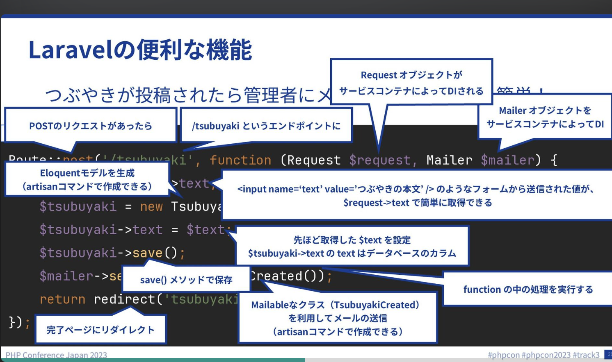  

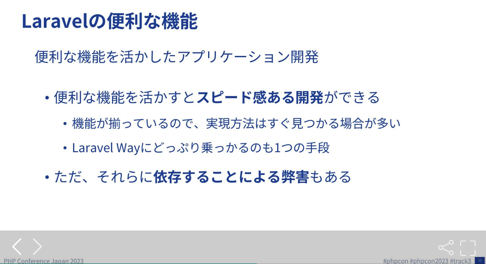  

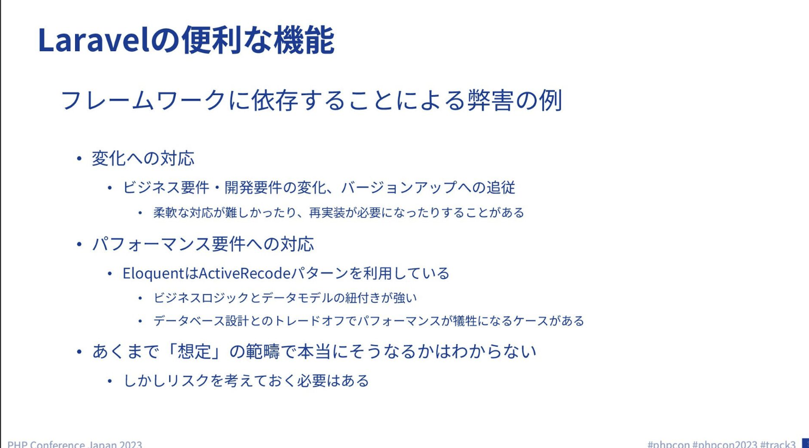  

・Laravel Wayにどっぷりつかるのもいいけど、バージョンアップへの追従が大変

・依存のリスクをしっかり考えておくのが大事

## Laravelとわたしたちのコードの距離を保つために

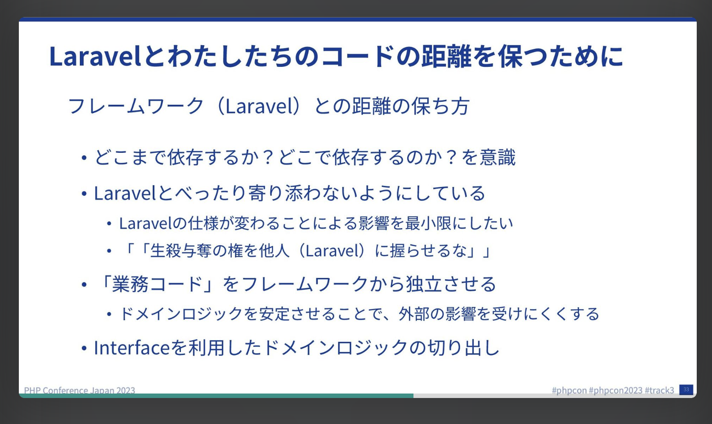  

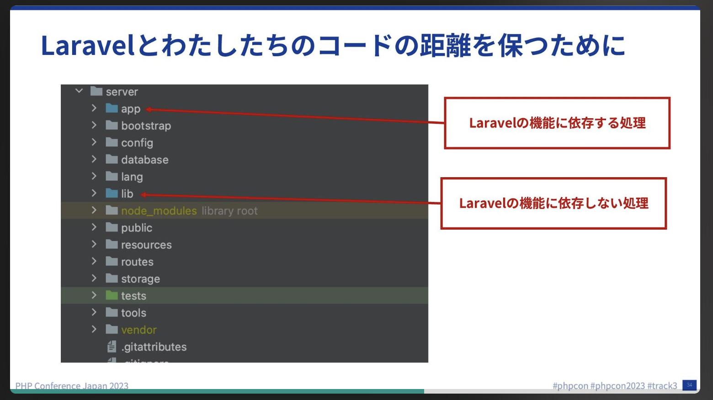  

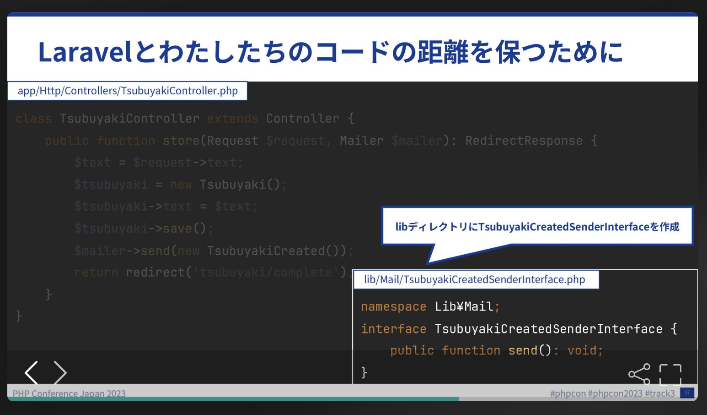  

・Mailerに依存しないようにinterfaceに依存するようにする

・interfaceと具象クラスの紐づけはService Providerで行う

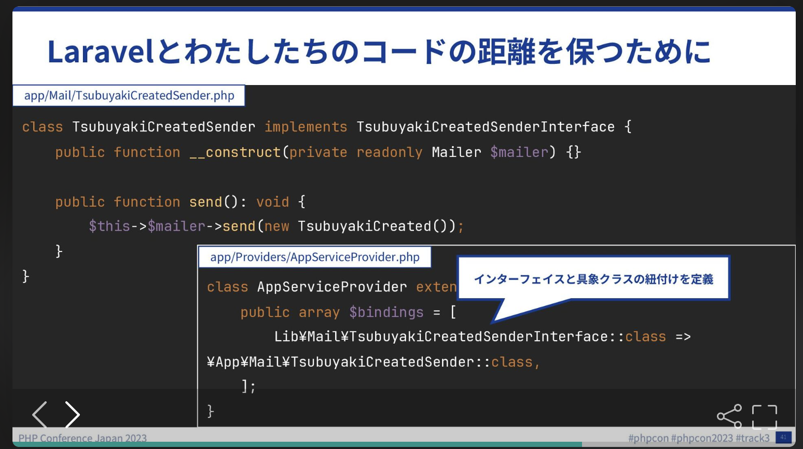  

・Eloquentも同様にinterfaceに依存するようにする

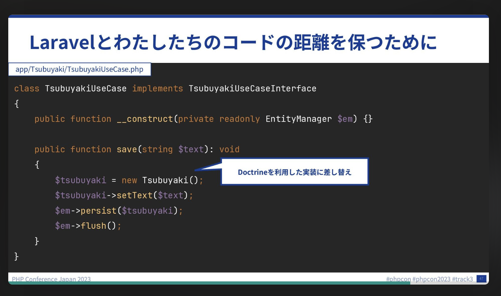  

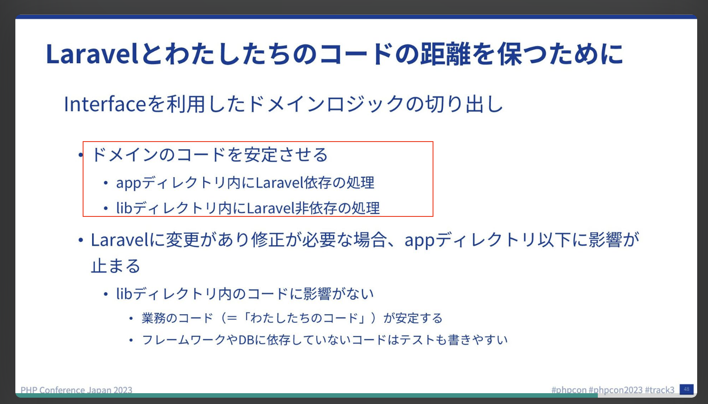  

・外部のサービスに依存している部分はinterfaceに依存するようにすることでドメインロジックを安全にするいい例

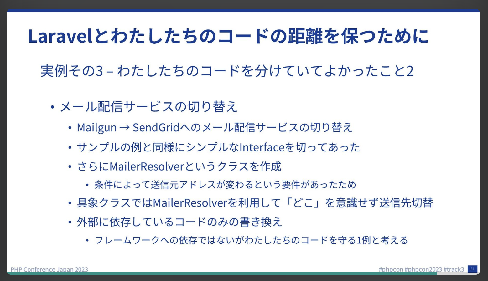  

・どこまでinterfaceを設けるかはフェーズに寄る

・PoCの場合は早くがいいが後戻りはできない可能性があるのでどの段階に入れておくのがいいかを考える

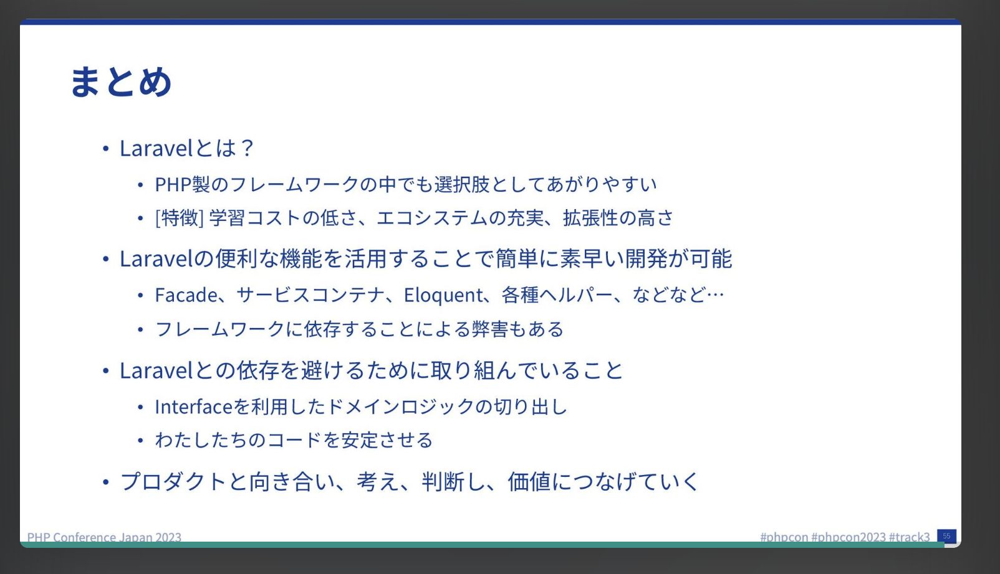  

